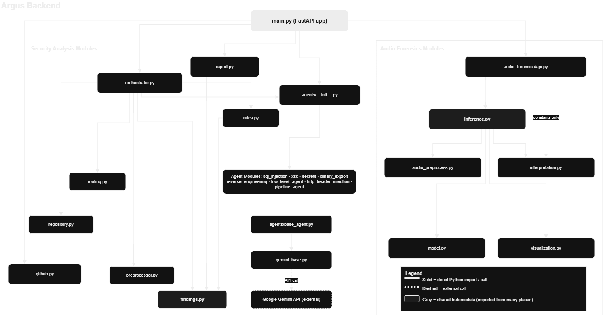

# Argus

Argus is a web application with two analysis workspaces: GitHub source-code security scanning and audio forensics. A React/Vite frontend talks to a FastAPI backend. The code scanner combines deterministic checks with signal-routed Google Gemini agents; the audio workflow analyzes recordings with digital signal processing and an optional local model.



Argus is a research and triage aid, not a replacement for a security review, a full static-analysis suite, a penetration test, or validated audio-authenticity testing. Code findings can be incomplete or incorrect. The default audio score is experimental and is not a calibrated probability or proof of authenticity. Verify results independently.

## Contents

- [Features](#features)
- [Architecture](#architecture)
- [GitHub security scanning](#github-security-scanning)
- [Security agents and rules](#security-agents-and-rules)
- [Audio forensics](#audio-forensics)
- [Requirements](#requirements)
- [Setup](#setup)
- [Configuration](#configuration)
- [Run locally](#run-locally)
- [HTTP API](#http-api)
- [Limits and supported inputs](#limits-and-supported-inputs)
- [Privacy and security](#privacy-and-security)
- [Tests and validation](#tests-and-validation)
- [Project layout](#project-layout)
- [Troubleshooting](#troubleshooting)

## Architecture


## Features

- Scan public or token-authorized private GitHub repositories from a URL.
- Stream security-scan progress to the browser using Server-Sent Events (SSE).
- Run deterministic vulnerability rules and, for AI-enabled scans, route only relevant files to specialized Gemini agents.
- Review repository metadata, detected signals, agent outcomes, severity summaries, and findings; download a PDF report.
- Upload or drop batches of audio files, inspect section-level measurements and visualizations, listen to sections, and export results as CSV.
- Use a built-in audio demo or optionally configure a trusted local audio model.

The security scanner and audio analyzer are independent pipelines that share the app shell and API process. Audio analysis does not call Gemini.

## Architecture

```text
Browser (React 19 / Vite)
  |-- GitHub Security workspace -- POST /api/analyze (SSE)
  `-- Audio Forensics workspace -- /api/audio/* (JSON + multipart)
             |
         FastAPI backend
     |-- Security scan pipeline
     |     clone -> collect -> preprocess -> rules
     |     -> route focused agents -> Gemini (optional)
     |     -> findings/PDF -> browser
     `-- Audio pipeline
         upload -> decode/resample -> segment/DSP
         -> baseline or optional local model
         -> interpretation/visual data -> browser
```

The app runs locally by default. It has no database, user login, or production deployment configuration. Security scans may contact GitHub and Google Gemini; audio analysis runs in the backend process using local libraries and any locally configured model artifact.

## GitHub security scanning

1. The user enters a GitHub repository URL, chooses `quick`, `standard`, or `deep`, and optionally supplies a GitHub token for private repositories.
2. `POST /api/analyze` validates the scan profile and returns a streaming response. A background thread normalizes and shallow-clones the repository into a temporary directory while the API streams progress events.
3. The collector selects supported source and configuration files. The preprocessor detects languages and heuristic security signals; signals help route analysis but do not prove a vulnerability.
4. Deterministic rules run for every profile. `quick` ends with rule-based results and does not call Gemini.
5. For `standard` and `deep`, the router chooses agents based on detected signals and gives each selected agent only the files associated with its signal categories. The agents run with a configurable concurrency limit and call Gemini.
6. Findings are normalized and deduplicated, repository metadata and timing are added, and a PDF report is written under `backend/reports` when the server is launched from `backend`. The temporary clone is deleted after the scan.

`standard` and `deep` currently use the same analysis path. `deep` is not a separate verification pass yet.

## Security agents and rules

Eight specialized agents are registered. The router runs only agents matching detected signals; agents can be skipped when no relevant signals are present.

| Agent | Review focus |
| --- | --- |
| SQL Injection Agent | Dynamic SQL construction and unsafe database queries |
| Cross-Site Scripting Agent | Unsafe browser HTML rendering and templates |
| Hardcoded Secrets Agent | Credentials and keys embedded in source or configuration |
| Binary Exploitation Agent | Native code and memory-unsafe patterns |
| Reverse Engineering Agent | Binary formats and unsafe deserialization |
| Low-Level & Memory Security Agent | Allocation, buffers, memory lifetime, races, and access control |
| HTTP Header Injection Agent | Host-header use and request-derived response headers |
| CI/CD & Pipeline Security Agent | Workflow injection, pipeline permissions, and container configuration |

Deterministic rules look for patterns associated with SQL injection, unsafe HTML/XSS, command execution, dynamic code execution, path traversal, server-side request forgery, open redirects, host-header misuse, response-header injection, hardcoded secrets, weak cryptography, disabled TLS verification, debug mode, and permissive CORS. These are heuristic checks and may produce false positives or miss issues.

## Audio forensics

The Audio Forensics workspace accepts one or more recordings and returns a per-file result. Uploads are processed independently so a bad file does not invalidate the rest of a batch.

1. The backend decodes supported files with SoundFile or the bundled FFmpeg executable provided by `imageio-ffmpeg`.
2. Audio is converted to mono 16 kHz, checked for duration and measurable signal, normalized, and divided into overlapping windows (4 seconds by default, with a 2-second hop).
3. Signal, frequency/spectral, MFCC, and timing features are calculated. The default experimental baseline produces section scores which are aggregated into a 0-100 review score.
4. The response includes plain-language interpretation, waveform and spectral visualization data, and section timestamps for playback review. The frontend can export batch results as CSV.

The baseline score is not calibrated and is not a probability that the recording is synthetic. A low score does not establish that audio is real. The default installation contains no pretrained speech model. An operator can configure a local detector and optional manipulation-type model; their predictions depend on the model and its evaluation. The built-in eight-second tone sample is a pipeline fixture, not a speech benchmark. It is identified as a known demo by content hash, not filename.

## How a scan works

1. The API normalizes the supplied GitHub URL and shallow-clones the repository into a temporary directory.
2. The collector reads supported source and configuration files, skipping common dependency and build directories.
3. The preprocessor detects broad signals such as SQL operations, request data, unsafe HTML rendering, credentials, native code, and deserialization.
4. Deterministic rules inspect the collected files and create rule-based findings.
5. In `standard` and `deep` profiles, the router selects agents for which relevant signals were found. Each selected agent receives the files associated with its signal categories.
6. Selected agents run concurrently up to the configured worker limit. The results are merged and deduplicated.
7. Argus summarizes repository metadata, writes a PDF report, and streams the completed scan result to the frontend.
8. The temporary clone is removed after the scan. The generated PDF remains in the backend reports directory for the server session.

The current implementation treats `standard` and `deep` the same: both run deterministic rules and signal-routed Gemini agents. They do not yet perform separate analysis passes. `quick` runs deterministic rules only and does not call Gemini.

## Security agents

| Agent | Focus | Routing signals |
| --- | --- | --- |
| SQL Injection Agent | Dynamic SQL construction and unsafe database queries | `sql_query`, `database_execution`, optionally `user_input` |
| Cross-Site Scripting Agent | Unsafe browser HTML rendering and templates | `javascript_dom`, `dangerous_html_rendering`, `html_template`, optionally `user_input` |
| Hardcoded Secrets Agent | Credentials or keys embedded in source/configuration | `secret_like_content` |
| Binary Exploitation Agent | Native and memory-unsafe code patterns | `memory_unsafe`, `native_code`, optionally `shell_execution` or `assembly_code` |
| Reverse Engineering Agent | Binary formats and unsafe deserialization patterns | `unsafe_deserialization`, `binary_format`, optionally `native_code` or `authentication` |

The preprocessor is deliberately heuristic: a signal is a reason to route a review, not proof that a vulnerability exists. The deterministic rules currently cover patterns associated with SQL injection, unsafe HTML/XSS, command and code injection, path traversal, server-side request forgery, open redirects, hardcoded credentials, weak cryptography, disabled TLS verification, debug mode, and permissive CORS.

## Requirements

- Python 3.10 or later.
- Node.js and npm compatible with Vite 7.
- Git on `PATH` to clone repositories.
- Network access to GitHub for repository cloning and optional repository metadata.
- A Google Gemini API key to run any selected AI agent. `quick` scans and audio analysis without a trained model do not require one.
- For AI-enabled scans, network access to the Gemini API. Audio decoding libraries and their dependencies are installed from `backend/requirements.txt`; a separate FFmpeg installation is not required.

## Setup

Run the backend and frontend in separate terminals from the repository root.

### Backend

Create and activate a virtual environment, then install the backend dependencies:

```powershell
cd backend
py -m venv .venv
.\.venv\Scripts\Activate.ps1
python -m pip install --upgrade pip
pip install -r requirements.txt
```

On macOS or Linux, activate the environment with `source .venv/bin/activate` instead.

Create `backend/.env` using the configuration example below. Do not commit this file.

### Frontend

In a second terminal:

```powershell
cd frontend
npm install
```

The frontend uses `http://localhost:8000` for the backend by default. To use another backend origin, create `frontend/.env.local` and set:

```dotenv
VITE_API_URL=http://localhost:8000
```

Restart Vite after changing frontend environment variables.

## Configuration

Create `backend/.env` for local backend settings. The following variables are read by the active security-agent client and scan pipeline:

```dotenv
# Required only when a routed Gemini agent runs
GEMINI_API_KEY=your-gemini-api-key

# Optional model and fallback
GEMINI_MODEL=gemini-2.5-flash
GEMINI_FALLBACK_MODEL=gemini-2.5-flash-lite

# Optional retry and concurrency settings
GEMINI_MAX_RETRIES=4
GEMINI_RETRY_BASE_DELAY=2
GEMINI_MAX_CONCURRENT_AGENTS=1

# Optional: private repository access when a token is not sent with the request
GITHUB_TOKEN=your-github-personal-access-token

# Optional: path to a trusted local audio detector artifact
ARGUS_AUDIO_MODEL=path/to/trusted-model.joblib
```

`GEMINI_MODEL` defaults to `gemini-2.5-flash`; `GEMINI_FALLBACK_MODEL` defaults to `gemini-2.5-flash-lite`. The active agent client reads `GEMINI_API_KEY` (it does not implement a numbered multi-key pool). If an agent is selected but no key is configured, that agent will fail and its status will appear in the scan results. Gemini transient errors use exponential backoff; model-not-found and daily-quota errors can trigger the fallback model.

Agent concurrency is controlled by `GEMINI_MAX_CONCURRENT` when set; otherwise `GEMINI_MAX_CONCURRENT_AGENTS` is used, defaulting to one worker:

| Value | Behavior |
| --- | --- |
| `1` | Run one selected agent request at a time. |
| `2` | Allow up to two agent requests at once. |
| Unset | Use the default of one worker. |

`GITHUB_TOKEN` is optional for public repositories. For private repositories, it must have access to the target repository; alternatively provide `github_token` in the scan request. The audio model path may be set with `ARGUS_AUDIO_MODEL`; without it, Argus uses the experimental baseline unless the default artifact path exists. Only load trusted local model files. Keep `.env` files and model artifacts out of source control.

## Run Argus

Run the backend and frontend in separate terminals.

Start the API from `backend`:

```powershell
cd backend
\.venv\Scripts\Activate.ps1
uvicorn main:app --reload --host 127.0.0.1 --port 8000
```

Start the frontend from `frontend` in the second terminal:

```powershell
cd frontend
npm run dev
```

Open the Vite URL printed in the frontend terminal, normally `http://localhost:5173`. The API is normally at `http://localhost:8000`; interactive OpenAPI docs are at `http://localhost:8000/docs`. CORS is configured for localhost and 127.0.0.1 development origins.

To build the frontend bundle, run `npm exec -- vite build` from `frontend`. Note that the current `npm run build` script invokes `vite` without the `build` subcommand, so it starts the Vite development server.

## HTTP API

Interactive request and response schemas are available at `/docs` while the backend is running.

| Method | Path | Description |
| --- | --- | --- |
| `GET` | `/` | Service name, status, and version. |
| `GET` | `/api/health` | Health check. |
| `GET` | `/api/agents` | Registered agents and their routing signals. |
| `GET` | `/api/capabilities` | Scan profiles, repository access options, provider, and agent count. |
| `POST` | `/api/analyze` | Start a scan and receive server-sent events. |
| `GET` | `/api/report/{scan_id}` | Download the completed scan's PDF report. |
| `GET` | `/api/audio/status` | Check audio-service availability and model/scoring mode. |
| `GET` | `/api/audio/sample` | Download the built-in demo recording. |
| `POST` | `/api/audio/analyze` | Analyze uploaded audio files as multipart form data. |

### Start a scan

`POST /api/analyze` accepts JSON:

```json
{
    "repository_url": "https://github.com/owner/repository",
    "scan_profile": "standard",
    "github_token": "optional-token-for-a-private-repository"
}
```

`repository_url` is required. `scan_profile` defaults to `standard` and must be `quick`, `standard`, or `deep`. `github_token` is optional; if omitted, the backend checks `GITHUB_TOKEN`. Supply a token with permission to read the private repository (for a classic token, this commonly means the `repo` scope).

The endpoint streams `text/event-stream`. Each event is a JSON object preceded by `data:` and separated by a blank line. Progress events have `type: "progress"`; a successful scan ends with a `type: "complete"` event whose `result` contains the scan response. Failures are sent as `type: "error"` events with a `detail` string.

Example request:

```bash
curl -N http://localhost:8000/api/analyze \
    -H "Content-Type: application/json" \
    -d '{"repository_url":"https://github.com/owner/repository","scan_profile":"quick"}'
```

The completed result includes a scan ID, normalized repository URL, repository overview, collected-file count, findings, severity totals, rule and AI finding counts, selected and skipped agents, preprocessing languages/signals, per-agent results, timing data, and a `report_url`.

Finding objects include an ID, title, vulnerability type, severity, confidence, file path, optional line number, evidence, description, recommendation, and source (`rule-based`, `ai`, or `hybrid`). The PDF report is available at the returned `report_url` or `/api/report/{scan_id}`.

### Audio analysis

`POST /api/audio/analyze` expects one or more multipart fields named `files`:

```bash
curl -X POST http://localhost:8000/api/audio/analyze \
    -F "files=@recording.wav"
```

The response contains a `results` array with a per-file result or error and `total_seconds`. Audio endpoints return ordinary JSON responses, not SSE. Check `/api/audio/status` for service availability, score mode, and whether a manipulation-type model is available.

## Source collection and limits

The repository collector recognizes Python, JavaScript/TypeScript, Java, PHP, Ruby, Go, C/C++, C#, SQL, HTML, Vue, environment files, and common configuration formats such as JSON, YAML, XML, INI, TOML, properties, and `.conf` files. It also includes Dockerfiles, Containerfiles, `docker-compose` files, and Jenkinsfiles. It skips `.git`, `node_modules`, virtual environments, Python caches, build output, `.next`, and coverage directories; common JavaScript lock files are excluded. Although Rust appears in older documentation, `.rs` is not in the current collector's extension list.

At most 150 files are collected per scan. Each file is truncated after 80,000 characters. A repository can contain additional files that are not reviewed because of these limits or unsupported file types.

Audio uploads accept 1-20 files per request, up to 50 MB each and 10 minutes per recording. Empty, silent, invalid, unsupported, and oversized files return per-file errors. Audio is decoded into temporary storage and removed after analysis. Actual browser playback support depends on the browser and codec.

## Privacy and security

## Privacy and security

- Repository cloning and deterministic scanning run in the backend process. When a Gemini agent runs, the selected source files are sent to Google Gemini. Review Google's current API data-handling terms before scanning confidential code.
- The collector recognizes `.env` and configuration files. Do not assume credentials in a repository are automatically removed before an AI request. Avoid scanning live secrets; use test credentials and rotate any credential exposed in source control.
- Quick scans do not send source to Gemini, but they still clone the GitHub repository and may query GitHub metadata for the repository overview.
- Private-repository GitHub tokens are used for cloning and metadata access and are not saved in scan results. Prefer the request-body token for one-off scans; do not put tokens in URLs or commit them.
- Keep Gemini and GitHub credentials in ignored local environment files or a secret manager. Never commit `.env` files. Repository scans can collect `.env` and configuration files; credentials are not automatically redacted before AI requests.
- Cloned source is deleted after each scan. PDFs are stored under `backend/reports` when the server is started from `backend`; clean that directory when reports are no longer needed.
- Audio is analyzed locally by the backend; uploads and decoded intermediates are deleted after analysis. A configured model artifact is loaded by the server and must be trusted.
- Argus runs without user authentication. Keep the backend bound to localhost unless you add appropriate authentication, authorization, and deployment protections.

## Validation

Install test dependencies from `backend` and run the audio-forensics tests from the repository root:

```powershell
python -m pip install -r backend/requirements-dev.txt
python -m pytest backend/audio_forensics
```

The tests cover audio decoding, multipart API behavior, partial failures, resampling, interpretation, model errors, and the health endpoint. They test software behavior, not detection accuracy.

Compile backend modules:

```powershell
cd backend
python -m compileall -q .
```

Build the frontend from `frontend`:

```powershell
cd frontend
npm exec -- vite build
```

For a local smoke test, check `/api/health`, `/api/agents`, and `/api/audio/status`, then try a small public repository with the `quick` profile. This exercises cloning, progress streaming, deterministic rules, results rendering, and PDF generation without requiring Gemini quota. Use the audio demo to smoke-test the audio path. Neither smoke test establishes detector accuracy.

## Project layout

```text
Argus/
|-- README.md                         Project guide
|-- argus-module-communication.drawio.png  Architecture image
|-- backend/
|   |-- main.py                        FastAPI routes, SSE, report endpoint
|   |-- github.py                      GitHub URL normalization, clone, overview
|   |-- repository.py                  Source-file collection and limits
|   |-- preprocessor.py                Language and security-signal detection
|   |-- routing.py                     Agent selection and focused-file routing
|   |-- rules.py                       Deterministic security rules
|   |-- orchestrator.py                Security scan stages and concurrency
|   |-- findings.py                    Finding schema and normalization
|   |-- gemini_base.py                 Gemini client, retries, model fallback
|   |-- gemini_client.py               Alternate client module (not used by registered agents)
|   |-- report.py                      PDF report generation
|   |-- agents/                        Eight specialized security agents
|   |-- audio_forensics/               Audio API, DSP, inference, interpretation, visuals
|   |-- reports/                       Generated PDF reports (local runtime output)
|   |-- requirements.txt               Backend and audio dependencies
|   `-- requirements-dev.txt           Pytest and HTTP test dependencies
`-- frontend/
    |-- src/App.jsx                    Workspace switch and repository scan client
    |-- src/components/                Scan UI, findings, audio UI, visualizations
    |-- public/                        Static frontend assets
    |-- index.html                     Vite entry HTML
    `-- package.json                   React/Vite dependencies and scripts
```

## Troubleshooting

| Symptom | Check |
| --- | --- |
| Frontend cannot connect to the API | Confirm Uvicorn is running on port 8000. Set `VITE_API_URL` in `frontend/.env.local` if needed, then restart Vite. |
| Private repository clone fails | Check the URL and token permissions. The token can be sent in the request or set as `GITHUB_TOKEN`. |
| No Gemini agents are selected | Routing is signal-based. Use a repository containing code relevant to an agent's trigger signals; `quick` never runs agents. |
| A selected agent fails immediately | Check that `GEMINI_API_KEY` is set and valid. Inspect the agent result and backend log for provider or model errors. |
| Gemini returns a rate/quota error | Reduce `GEMINI_MAX_CONCURRENT` or `GEMINI_MAX_CONCURRENT_AGENTS`, wait for quota recovery, or check provider limits. The active client uses one API key and an optional model fallback. |
| Audio status reports unavailable | Confirm audio dependencies installed successfully, then check backend logs and any `ARGUS_AUDIO_MODEL` path. |
| An audio file fails | Check that it is decodable, non-empty, not silent, within 50 MB, and no longer than 10 minutes. Failures are reported per file. |
| PDF download returns 404 | Reports are local to the backend process and created only after a scan completes. Use the `report_url` from that scan result and keep the server running. |
